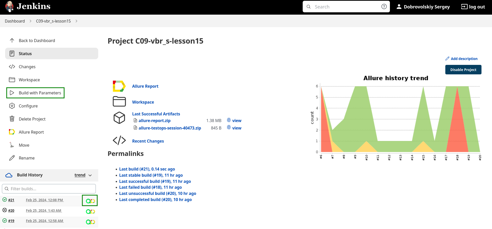
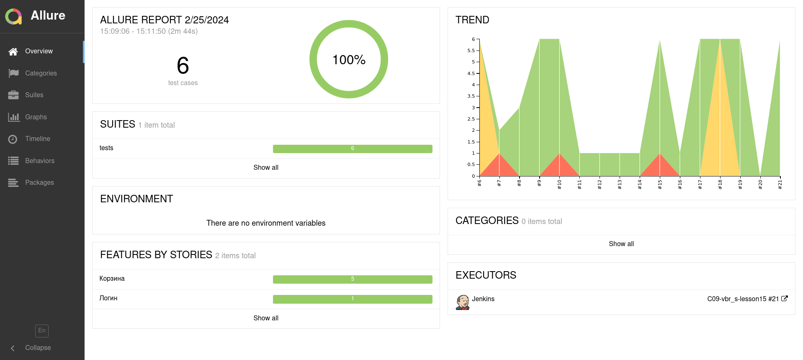
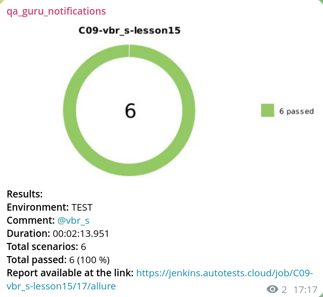

<h1 align="center">Проект UI автотестов книжного магазина
<p align="center">
<a href="respublica.ru">  </a> </h1>


<h3 align="center">Python | Pytest | Selene | Jenkins | Allure | Selenoid | Telegram</h3>
<h3 align="center">
      &nbsp;&nbsp;&nbsp;&nbsp;&nbsp;
      &nbsp;&nbsp;&nbsp;&nbsp;&nbsp;
      &nbsp;&nbsp;&nbsp;&nbsp;&nbsp;
     &nbsp;&nbsp;&nbsp;&nbsp;&nbsp;
      &nbsp;&nbsp;&nbsp;&nbsp;&nbsp;
    &nbsp;&nbsp;&nbsp;&nbsp;&nbsp;

</h3>


---

### Реализованы тесты:

- [x] Логин
- [x] Добавление одного товара в корзину
- [x] Добавление нескольких товаров одного типа в корзину
- [x] Добавление нескольких разных товаров в корзину
- [x] Удаление одного товара из корзины
- [x] Очистка корзины

## Запуск тестов

### Локально

> _Рекомендуется, т.к. на selenoid школы запуск невозможен из-за капчи cloudflare_

1. Клонируем репозиторий

```bash
git clone https://github.com/vinterbris/qa_guru_python_9_15.git
```

2. Выполняем в терминале pycharm (linux\mac):

```bash
python -m venv .venv
pip install -r requirements.txt
source .venv/bin/activate
pytest .
```

<details open>
  <summary>Для Windows:</summary>

```bash
python -m venv .venv
pip install -r requirements.txt
.venv/Scripts/activate
pytest .
```

</details>

<details>
  <summary><b>Устанавливаем Allure</b></summary>

Linux\Mac через Homebrew

```bash
brew install allure
```

Windows через scoop

```bash
scoop install allure
```

3. После запуска тестов получить отчёт allure командой (если добавлен в PATH):

Linux\Mac

```bash
allure serve
```

Windows

```bash
allure.bat serve
```

[Установить из напрямую из релизов с github](https://github.com/allure-framework/allure2/releases)

<details>
    <summary>Инструкция при установке из архива</summary>

1. Скачать последнюю версию под свою систему
2. Разархивировать в корень проекта
3. Папку (например `allure-2.27.0`) переименовываем в `allure`
4. Аллюр из архива готов, теперь запускать отчет можно из корня проекта командой:

Linux\Mac:

```bash
allure/bin/allure serve
```

Win:

```bash
allure/bin/allure.bat serve
```

</details>

[Другие варианты](https://allurereport.org/docs/gettingstarted-installation/)

</details>

### Удаленно через jenkins + selenoid

> _На selenoid школы была поздно обнаружена капча cloudflare, поэтому для запуска через jenkins нужен отдельно_
> развернутый selenoid

<details>
  <summary>Относительно быстро разворачиваем selenoid в vm или локально</summary>

Официальная [инструкция](https://aerokube.com/cm/latest/#_quick_start_guide)

1. Ставим [virtualbox](https://www.virtualbox.org/wiki/Downloads)
2. Качаем
   образ [ubuntu](https://sourceforge.net/projects/linuxvmimages/files/VirtualBox/U/22.04/Ubuntu_22.04_VB.7z/download)

```bash
wget https://sourceforge.net/projects/linuxvmimages/files/VirtualBox/U/22.04/Ubuntu_22.04_VB.7z/download`
```

5. Разархивируем и добавляем в virtualbox
4. Запускаем vm (логин\пароль: ubuntu\ubuntu)
5. Устанавливаем докер:

```bash
# Add Docker's official GPG key:
sudo apt-get update
sudo apt-get install ca-certificates curl
sudo install -m 0755 -d /etc/apt/keyrings
sudo curl -fsSL https://download.docker.com/linux/ubuntu/gpg -o /etc/apt/keyrings/docker.asc
sudo chmod a+r /etc/apt/keyrings/docker.asc

# Add the repository to Apt sources:
echo \
  "deb [arch=$(dpkg --print-architecture) signed-by=/etc/apt/keyrings/docker.asc] https://download.docker.com/linux/ubuntu \
  $(. /etc/os-release && echo "$VERSION_CODENAME") stable" | \
  sudo tee /etc/apt/sources.list.d/docker.list > /dev/null
sudo apt-get update

sudo apt-get install docker-ce docker-ce-cli containerd.io docker-buildx-plugin docker-compose-plugin
sudo docker run hello-world
```

6. Устанавливаем selenoid:

```bash
wget https://github.com/aerokube/cm/releases/download/1.8.7/cm_linux_amd64
mv cm_linux_amd64 cm
chmod +x cm
sudo usermod -aG docker $USER
newgrp docker
```

```bash
./cm selenoid start --vnc
./cm selenoid-ui start
```

7. Селеноид развернут. Интерфейс доступен по ссылке http://localhost:8080/#/
8. Адрес для использования в тестах: http://localhost:4444/wd/hub
9. Пробрасываем локальные адреса в интернет при помощи опенсорс утилиты [localtunnel](https://localtunnel.github.io)
    1. Ставим npm
   ```bash
   sudo apt install nodejs npm
   ```
    2. Ставим localtunnel
   ```bash
   npm install -g localtunnel
   ```
    3. Запускаем туннель до нашего селеноид на localhost (SELENOID_URL)
   ```bash
   lt --port 4444
   ```
    4. Во 2-м терминале запускаем туннель до selenoid-ui (SELENOID_UI_URL)
   ```bash
   lt --port 8080
   ```
    5. Открываем ссылку для selenoid-ui - чтобы ее открыть требуется пароль (тесты обходят через хедер)
    6. Пароль - наш ip по [ссылке](https://loca.lt/mytunnelpassword)
    7. Теперь доступен просмотр видео в allure отчёте
10. Берем ссылки от localtunnel и указываем их дальше в jenkins

</details>

1. Переходим в [jenkins](https://jenkins.autotests.cloud/job/C09-vbr_s-lesson15/)
2. Нажимаем Build with parameters
3. Указываем SELENOID_URL и SELEOID_UI_URL (если нужен доступ к видео)
4. Нажимаем кнопку Build
5. По окончанию прогона нам доступны [allure отчет ](https://jenkins.autotests.cloud/job/C09-vbr_s-lesson15/17/allure/)и
   allure testops отчет
6. В отчете доступны логи, скриншоты и видео (если используется корректная ссылка для selenoid-ui)



<details open>
  <summary>Allure report и Allure TestOps</summary>




</details>


#### Локальный запуск через selenoid

> _Для запуска из vm потребуются ссылки от localtunnel_

```bash
pytest . --selenoid=True --browser_version=120.0 --selenoid_url=http://localhost:4444/wd/hub --selenoid_ui_url=http://localhost:8080/#/
```

`--selenoid=True`   - запуск через selenoid (дефолт False)  
`--browser_versio`  - версия браузера (дефолт 120.0 для Chrome)  
`--selenoid_url`    - адрес selenoid (дефолт - localhost)  
`--selenoid_ui_url` - адрес selenoid-ui (дефолт - localhost)

## Пример запуска тестов

> _Сайт на высокой скорости дает нестабильные тесты и иногда падает с 500-й ошибкой, поэтому темп прогона прогулочный_

https://github.com/vinterbris/qa_guru_python_9_15/assets/21102027/61ba7f0b-e5d1-486c-bdce-e55f67388d89

## Оповещения в мессенджер

> _Настроена отправка оповещений в телеграм канал. Возможна настройка для email, slack, discord, skype, mattermost_




