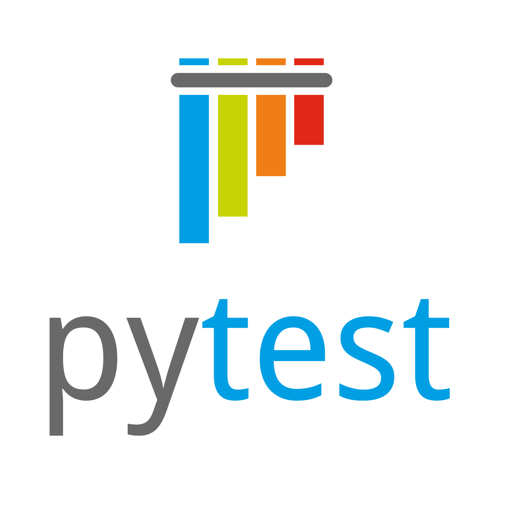
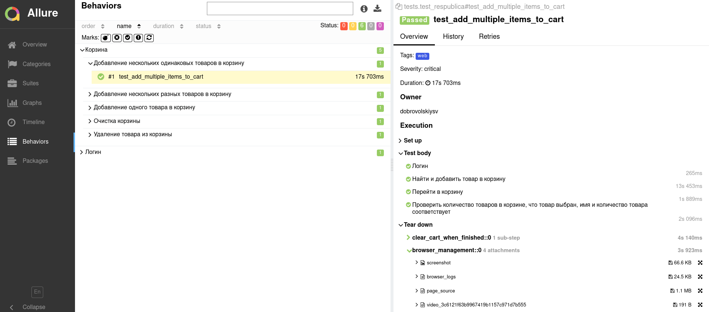
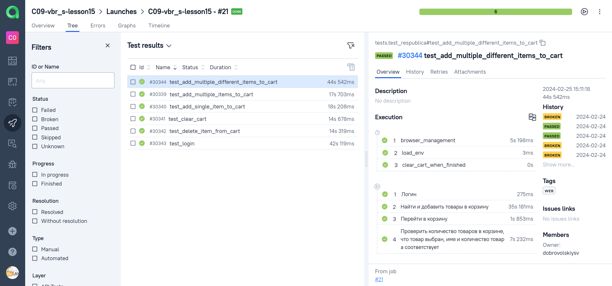
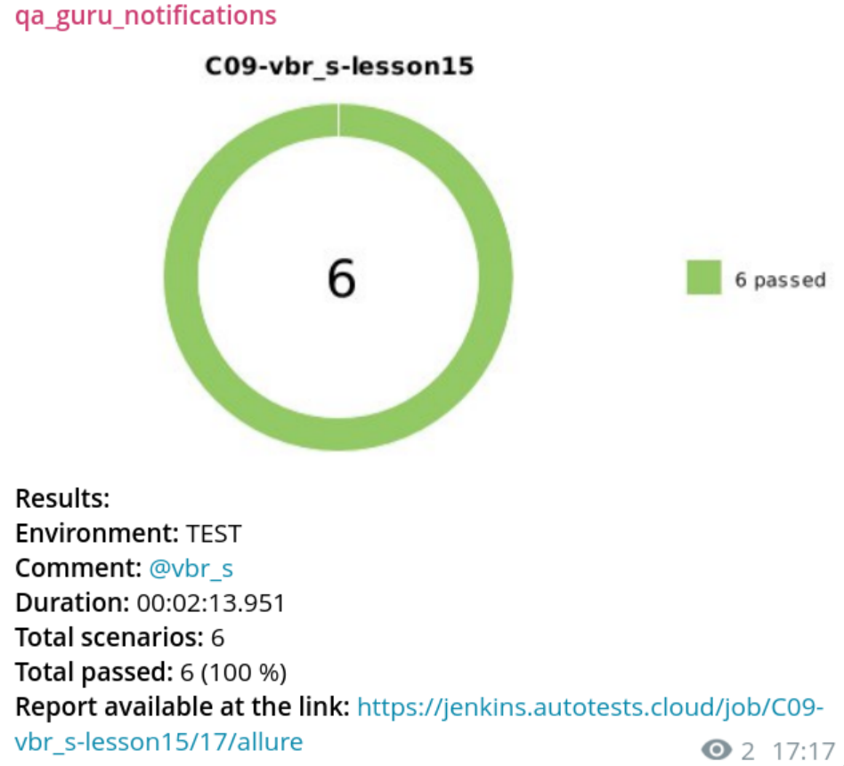

<h1 align="center">Проект UI автотестов книжного магазина
   <p align="center">
   <a href="respublica.ru"> 
      
   </a> 
</h1>


<h3 align="center">Python | Pytest | Selene | Jenkins | Allure | Selenoid | Telegram</h3>
<h3 align="center">
      &nbsp;&nbsp;&nbsp;&nbsp;&nbsp;
      &nbsp;&nbsp;&nbsp;&nbsp;&nbsp;
      &nbsp;&nbsp;&nbsp;&nbsp;&nbsp;
     &nbsp;&nbsp;&nbsp;&nbsp;&nbsp;
      &nbsp;&nbsp;&nbsp;&nbsp;&nbsp;
    &nbsp;&nbsp;&nbsp;&nbsp;&nbsp;

</h3>


---
> <a target="_blank" href="http://176.123.163.26:8888/job/respublica-project/">Ссылка на проект в мой Jenkins: доступны прогоны и allure отчёты</a>
</a>

### Реализованы тесты:

- [x] Логин
- [x] Добавление одного товара в корзину
- [x] Добавление нескольких товаров одного типа в корзину
- [x] Добавление нескольких разных товаров в корзину
- [x] Удаление одного товара из корзины
- [x] Очистка корзины

## Запуск тестов

### Локально

1. Клонируем репозиторий

```bash
git clone https://github.com/vinterbris/qa_guru_python_9_15.git
```

2. Создаём в корневой директории файл .env и вносим в него логин и пароль для магазина. 

```bash
cp .env.example .env
```

3. Выполняем в терминале в директории проекта:

```bash
python -m venv .venv
pip install -r requirements.txt
source .venv/bin/activate
pytest .
```


### Локально через удалённый Selenoid
В .env включаем selenoid, указываем доступную на нём версию браузера и его url

```
SELENOID=True
BROWSER_VERSION=127.0
SELENOID_URL=http://localhost:4444
```

<details open>
  <summary>Allure report и Allure TestOps</summary>





</details>


## Оповещения в мессенджер

> _Настроена отправка оповещений в телеграм канал. Возможна настройка для email, slack, discord, skype, mattermost_




## Пример запуска тестов

https://github.com/vinterbris/qa_guru_python_9_15/assets/21102027/bb5e26de-4ce1-4e00-b360-76e9d196f444

https://github.com/vinterbris/qa_guru_python_9_15/assets/21102027/fc5dbb2a-3acd-4968-b9da-d3a38175f64f


